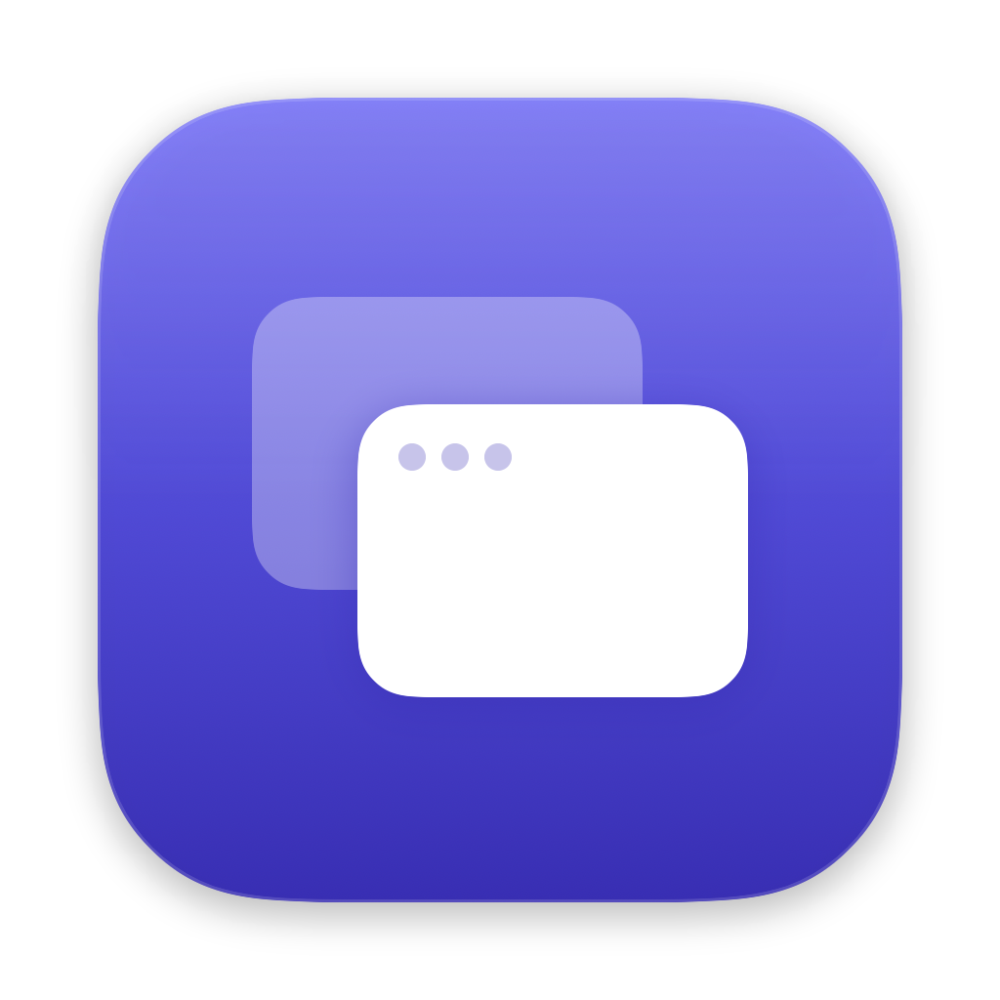
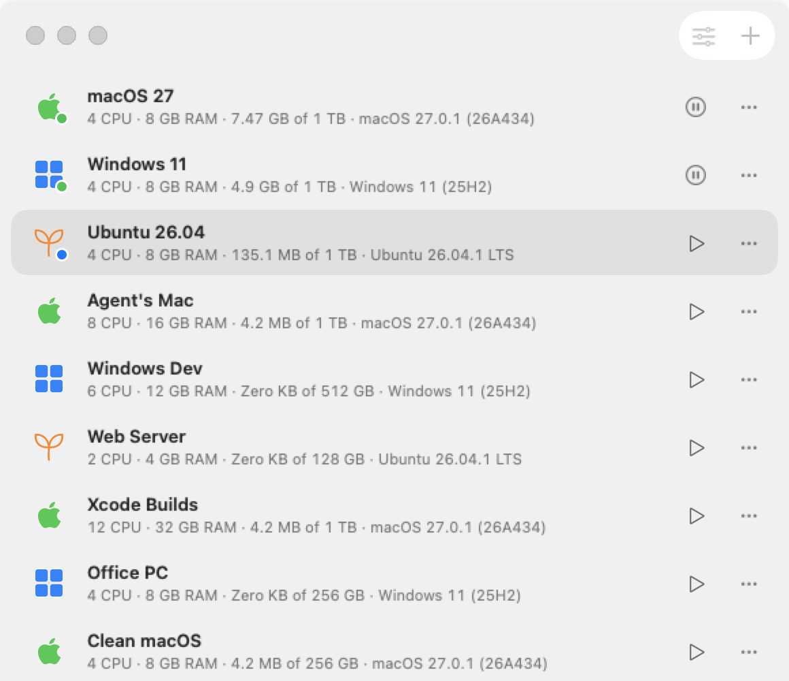

<p align="center">
  
</p>

<h1 align="center">PocketVM</h1>

<p align="center">
  Virtual machines for Apple silicon — for you, and for your AI agents.<br>
  macOS and Linux on Apple's Virtualization framework, with a built-in MCP server.
</p>

<p align="center">
  <strong>⚠️ Alpha</strong> — early and evolving. Expect rough edges, and keep backups of anything important in your machines.
</p>

<p align="center">
  
</p>

## Features

- **macOS guests** — downloads the newest macOS your Mac supports straight from Apple (or uses your `.ipsw`) and installs it.
- **Linux guests** — one-click Ubuntu 26.04 and Fedora 44 (checked against the publisher's SHA-256), or any arm64 ISO. Rosetta for x86 binaries, nested virtualization on M3 and later.
- **Windows 11 ARM** — boots from your ISO. *Experimental:* the Virtualization framework has no Windows GPU or network drivers.
- **A native Mac app** — compact SwiftUI library with live status lights, frosted glass, a Dock menu listing every machine, and per-machine windows whose display follows the window size.
- **Snapshots** — instant APFS clones; a running machine keeps its memory, so restoring resumes exactly where it was.
- **Suspend, pause, clone** — suspend to disk, duplicate as a copy-on-write clone, grow disks, share a Mac folder.
- **Port forwarding** — reach a server in a guest at `localhost` on your Mac.
- **PocketVM Tools for Linux** — clipboard sync with the Mac (works on Wayland), and terminal-friendly shortcuts: **Ctrl+C** copies, **Ctrl+V** pastes, **Ctrl+C twice** interrupts.
- **Live stats** — CPU, memory and disk I/O per machine, measured on its own Virtualization process.
- **Built for agents** — an MCP server lets coding agents create machines, see the screen, read it with on-device OCR, use the keyboard and mouse, run commands, and snapshot before risky work. Your Mac itself is never touched.

## Requirements

- A Mac with Apple silicon
- macOS 26 or later
- Xcode 26 to build from source

## Install

Download `PocketVM.zip` from [Releases](../../releases) (the current build is an alpha pre-release), unzip it, and move **PocketVM** to Applications.

Release builds are ad-hoc signed, not notarized. The first time, right-click PocketVM → **Open**, or run:

```sh
xattr -dr com.apple.quarantine /Applications/PocketVM.app
```

## Build from source

```sh
git clone https://github.com/petopagi/pocketvm.git
cd pocketvm
./build.sh              # → build/PocketVM.app
./build.sh --install    # also copies it to /Applications (quit PocketVM first)
```

`build.sh` builds with SwiftPM and signs the app ad-hoc with the `com.apple.security.virtualization` entitlement, which is all the Virtualization framework needs to run locally.

Handy flags: `--demo` shows a sample library without touching disk, `--light` forces light mode.

## Using it

Click **+** to create a machine: pick macOS, Linux or Windows, choose resources, and PocketVM downloads and sets it up. Double-click a machine (or press play) to open its window; closing the window pauses it.

The **•••** menu on each machine has snapshots, settings, suspend, shut down, duplicate, and Move to Trash.

### PocketVM Tools (Linux)

Linux machines with GNOME offer PocketVM Tools in a small card once you're signed in. **Install** runs in the background: PocketVM plugs in a read-only tools disk, opens a terminal in the guest, and installs a GNOME Shell extension plus a small relay into your home folder — no `sudo`. Log out and back in to finish.

The tools talk to the Mac over a private virtio-vsock port that nothing else can reach, and only while **Share Clipboard** (in the machine window's toolbar) is on.

## AI agents (MCP)

PocketVM serves [MCP](https://modelcontextprotocol.io) over Streamable HTTP at `http://127.0.0.1:7979/mcp`, protected by a bearer token. Open **File → Connect AI Agents…** (⇧⌘K) for the token and ready-made setup for Claude Code, Codex and Gemini CLI, or use this with any MCP client:

```json
{
  "type": "http",
  "url": "http://127.0.0.1:7979/mcp",
  "headers": { "Authorization": "Bearer <token>" }
}
```

Agents can use machines that have **Settings → Let AI agents use this machine** turned on, plus any machine they create.

| Area | Tools |
| --- | --- |
| Library | `list_machines` `host_info` `create_machine` `machine_status` `update_machine` `clone_machine` `delete_machine` |
| Power | `power` — start · pause · resume · suspend · shutdown · force_stop |
| Snapshots | `snapshot` `restore_snapshot` `delete_snapshot` |
| Seeing | `screenshot` (with `region` to zoom) · `read_screen` (OCR with click points) · `find_text` · `wait_for_text` |
| Acting | `click_text` `click` `move_mouse` `drag` `scroll` `type_text` `press_keys` |
| Files | `send_files` (read-only USB drive) · `eject_files` · `install_guest_tools` |
| Network | `network` (IP, open ports, traffic) · `forward_port` `remove_port_forward` · `run_command` (SSH) |
| Misc | `wait` |

Input goes to the machine's own virtual keyboard and mouse, so the Mac needs no Accessibility permission. Screenshots read the display surface directly; if that isn't available, PocketVM falls back to ScreenCaptureKit on its own window, which asks once for Screen Recording.

Try asking your agent: *"Create an Ubuntu machine in PocketVM, install it, then open Firefox and take a screenshot."*

## Isolation

Each machine runs on Apple's hypervisor inside its own sandboxed `com.apple.Virtualization.VirtualMachine` process. PocketVM controls the bridges between guest and Mac, and they start closed:

| Bridge | Default | Notes |
| --- | --- | --- |
| Network | NAT | `none` removes the network device. With NAT the guest reaches the internet, the Mac's services on `192.168.64.1`, and your LAN. |
| MCP server, port forwards | Mac only | Bound to `127.0.0.1`; unreachable from guests. |
| Clipboard | Off | Switch it per machine; nothing crosses while it's off. |
| Shared folder | None | Read-only by default when added. |
| Nested virtualization | Off | Linux on M3 and later. |
| Microphone, USB passthrough | Never | Speaker output only. Installer ISOs attach read-only. |
| `run_command` | — | SSH with agent, X11 and port forwarding forced off. |
| Downloads | — | Linux presets are verified against published SHA-256 lists; macOS restore images are verified by Apple's installer. |

Everything that comes out of a machine — screen text, screenshots, command output — reaches agents as untrusted data, and the MCP instructions say so.

## Where things live

- Machines: `~/Library/Application Support/PocketVM/Machines/*.pocketvm` (config, disk, NVRAM, snapshots)
- Download cache: `~/Library/Application Support/PocketVM/Downloads`

## Known limitations

- Linux guests render in software (no virtio-gpu acceleration in the Virtualization framework), so heavy desktop effects cost CPU.
- Windows guests are experimental.
- On rare occasions a screenshot can return a slightly stale frame.

## License

[MIT](LICENSE)
